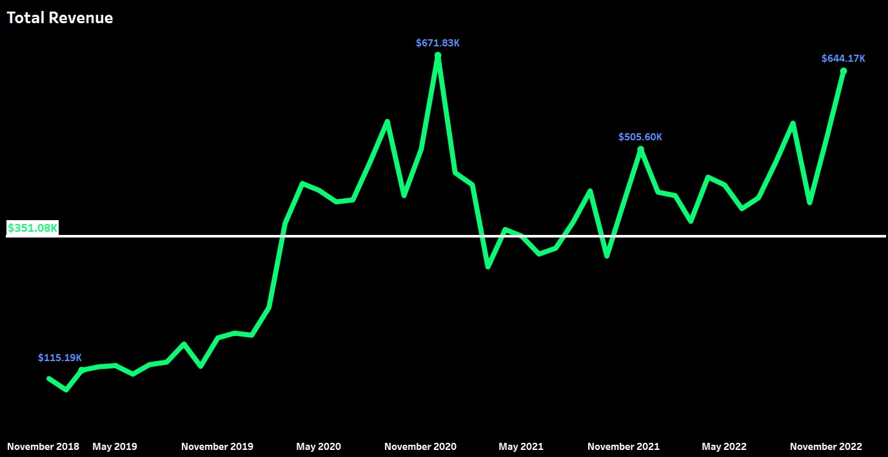
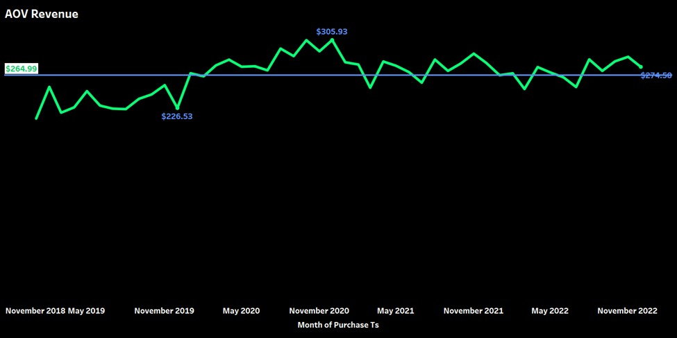
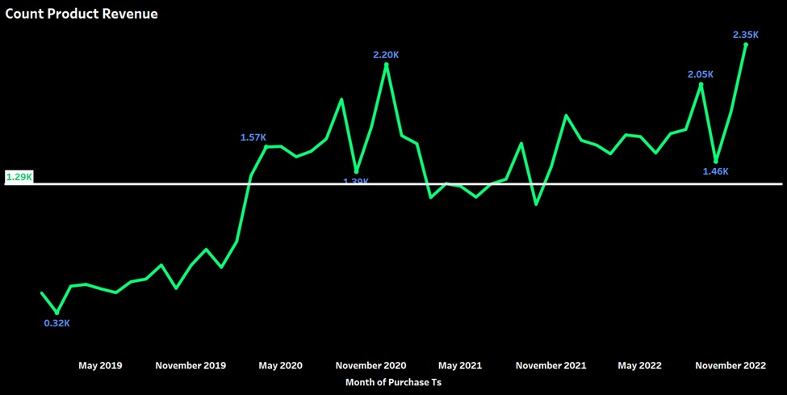
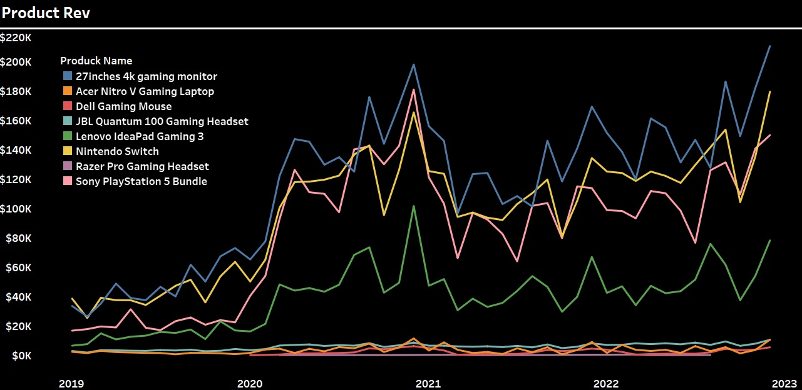
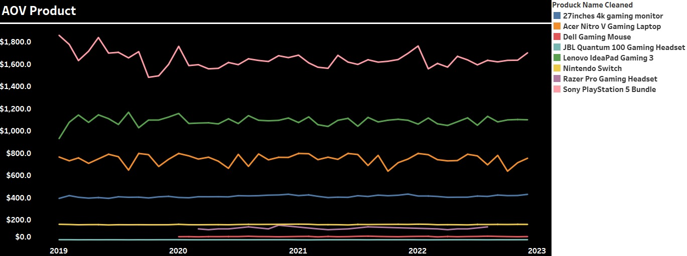
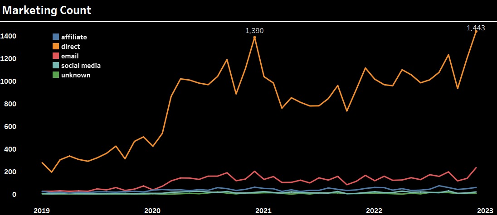
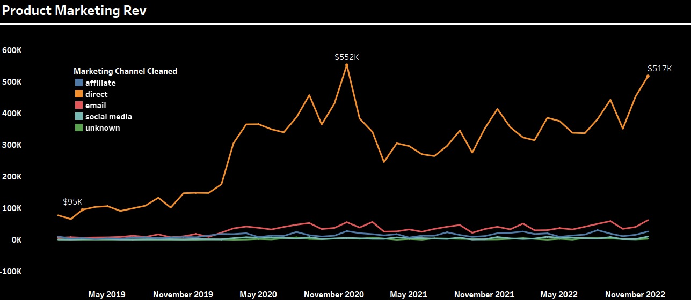
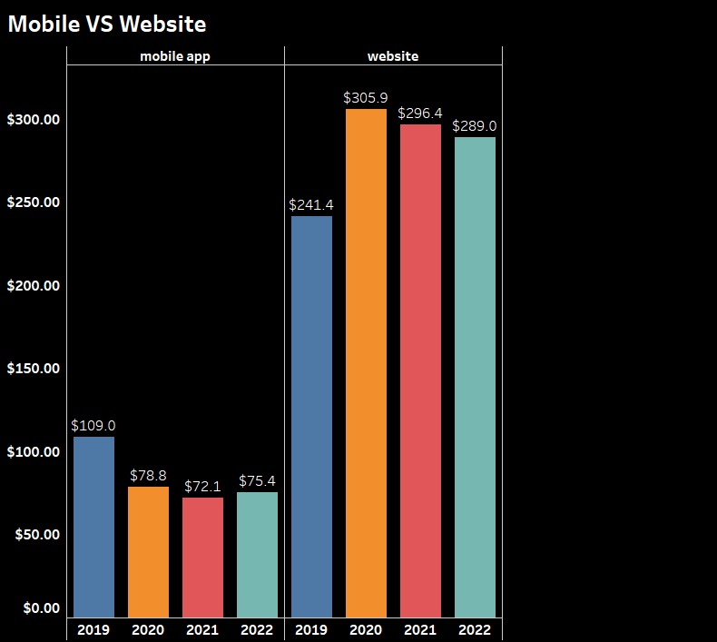
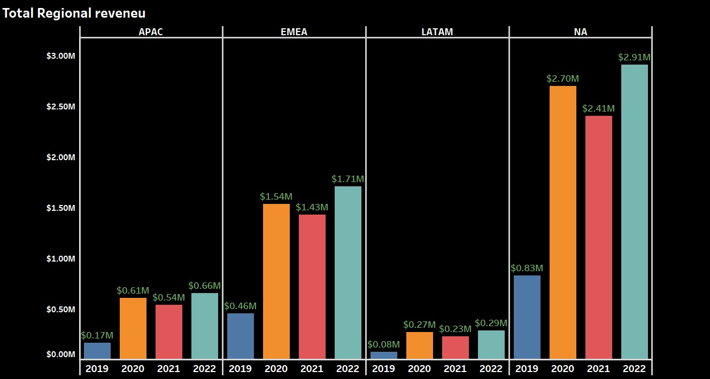
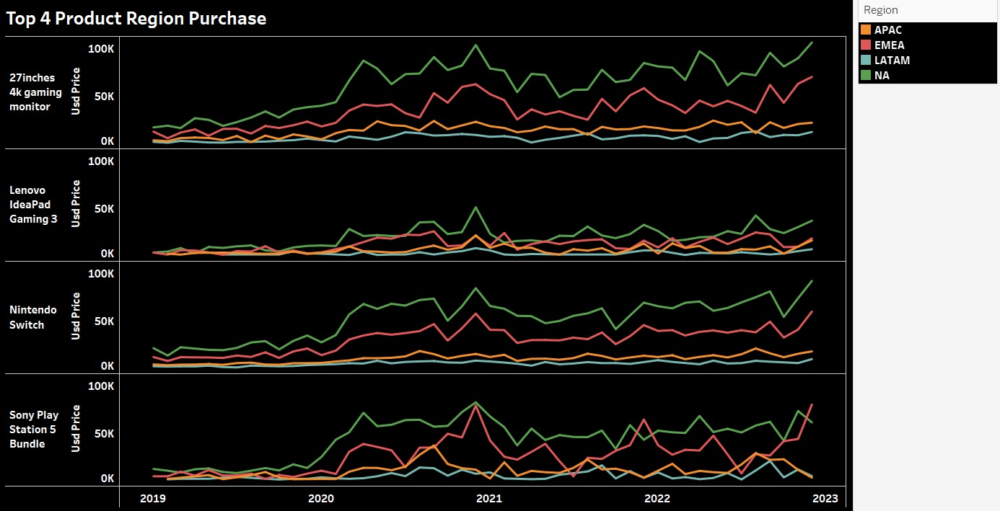

<h1 align ="center">Share Tech: Retail Sales Performance & Strategic Growth Analysis (2019–2022)</h1>

Project ini merupakan analisis komprehensif terhadap kinerja bisnis Share Tech, sebuah peritel elektronik global, selama periode empat tahun <b>(2019–2022)</b>. Dengan memanfaatkan data historis penjualan, proyek ini bertujuan untuk mengevaluasi kesehatan bisnis pasca-pandemi, mengidentifikasi pola perilaku konsumen, serta menemukan pendorong pertumbuhan utama (key growth drivers) untuk menyusun strategi ekspansi tahun <b>2023</b>.

Data menunjukkan bahwa Share Tech telah berhasil melakukan scale-up operasional secara permanen, dengan pendapatan tahunan yang pulih secara "V-Shape" mendekati rekor tertinggi di angka <b>$644.17K</b> pada akhir <b>2022</b>.

<h3>Fokus Analisis</h3>
<ul>
<li><b>Revenue & Seasonality:</b> Analisis tren pertumbuhan, pola lonjakan musiman (Q4), dan resiliensi daya beli pelanggan (AOV).
<li><b>Product Mix:</b> Identifikasi produk unggulan (Cash Cows) vs produk pelengkap.
<li><b>Regional Dynamics:</b> Komparasi dominasi pasar Amerika Utara (NA) vs peluang ekspansi agresif di Eropa (EMEA).
<li><b>Efficiency Metrics:</b> Audit efektivitas kanal pemasaran (ROI) dan analisis kesenjangan konversi (Trust Gap) antara Website vs Mobile.</ul>

<h2>1. Revenue Dynamics</h2>
<table border="0" width="100%">
  <tr>
    <td width="33%" align="center">
      
    </td>
    <td width="33%" align="center">
      
    </td>
    <td width="33%" align="center">
      
    </td>
  </tr>
  
  <tr>
    <td valign="top">
      <h3>Total Revenue</h3>
      <ul>
        <li><b>V-Shaped Recovery:</b> Pendapatan <i>rebound</i> agresif ke <b>$644.17K</b> (<b>2022</b>) setelah koreksi pasar, mendekati puncak pandemi <b>$671.83K</b> (<b>2020</b>). Ini memvalidasi permintaan produk yang fundamental.</li>
        <li><b>Elevated Baseline:</b> Skala bisnis membesar permanen. Pendapatan bulanan konsisten di atas rata-rata <b>$351K</b> sejak <b>2021</b>, tumbuh <b>&gt;300%</b> dibanding level awal 2019 (<b>$115K</b>).</li>
        <li><b>Validation:</b> Kemampuan bisnis untuk kembali menembus level
    <b>$600K+</b> membuktikan bahwa permintaan produk bersifat fundamental
    dan berkelanjutan, bukan sekadar fenomena sesaat
    (<i>one-off event</i>).</li>
      </ul>
    </td>
    <td valign="top">
      <h3>Average Order Value (AOV)</h3>
      <ul>
      <li>
    <b>Above Baseline:</b> Garis Hijau (AOV) bergerak stabil di atas garis
    rata-rata historis (<b>$264.99</b>). Meskipun masa puncak pandemi telah
    lewat, pelanggan tetap membelanjakan lebih banyak uang per transaksi
    dibandingkan standar masa lalu.</li>
        <li><b>Spending Power Resilience:</b> AOV <b>2022</b> bertahan di <b>$274.50</b>, di atas rata-rata historis (<b>$265</b>), membuktikan basis pelanggan loyal yang tidak sensitif harga (<i>price-insensitive</i>).</li><li>
    <b>The Peak:</b> Lonjakan tertinggi terjadi pada pertengahan periode
    mencapai <b>$305.93</b>, didorong oleh panic buying atau kebutuhan
    WFH (<i>Work From Home</i>) mendadak.</li>
      </ul>
    </td>
    <td valign="top">
      <h3>Sales Volume</h3>
      <ul>
        <li><b>Record-Breaking Demand:</b> Volume penjualan mencetak rekor <b>2.35K unit</b> di akhir <b>2022</b>, melampaui puncak pandemi <b>2020</b> (<b>2.20K</b>).</li><li>
    <b>New Standard:</b> Garis rata-rata berada di <b>1.29K</b>. Perhatikan
    bahwa sejak pertengahan <b>2022</b>, titik terendah bulanan
    (<i>monthly lows</i>) sekalipun tetap bertahan di atas garis rata-rata ini.</li>
     <li><b>Sustainable Growth:</b> Ini adalah sinyal vital bahwa bisnis bukan
    hanya "keajaiban sesaat" pandemi, melainkan memiliki permintaan
    organik yang terus membesar secara berkelanjutan.</li>
      </ul>
    </td>
  </tr>
</table>

<h2>2. Product Performance</h2>

<table border="0" width="100%">
  <tr>
    <td width="50%" align="center">
      
    </td>
    <td width="50%" align="center">
      
    </td>
  </tr>
  
  <tr>
    <td valign="top">
      <h3>Revenue Drivers</h3>
      <ul>
        <li><b>PS5 Bundle</b> dan <b>Monitor 4K</b>, konsisten mencetak <b>$180K–$220K/bulan</b>.</li>
        <li><b>Lenovo IdeaPad Gaming 3</b> menunjukkan tren pertumbuhan paling stabil (2021-2022), sukses menjadi kontributor lapis kedua.</li>
        <li> <b>Mouse</b>, <b>Headset</b> <i>stagnan</i> di bawah <b>$20K</b>. Strategi terbaik adalah menjadikannya item <i>bundling</i>, bukan fokus penjualan utama.</li>
      </ul>
    </td>
    <td valign="top">
      <h3>AOV Product </h3>
      <ul>
        <li><b>PS5</b> di Harga premium <b>$1,600–$1,800</b>. Setiap unit memberikan nilai transaksi masif.</li>
        <li><b>Monitor 4K:</b> Harga kompetitif <b>~$400</b>. Karena total pendapatannya menyamai PS5, ini berarti volume penjualannya <b>4x lipat</b> lebih tinggi (<i>High Turnover</i>).</li>
        <li><b>Laptop</b> (<b>~$1,100</b>) dan <b>Switch</b> (<b>~$700</B>) mengisi segmen menengah dengan baik.</li><li>
    <b>Basket Fillers:</b> Produk seperti Mouse, Headset, dan lain-lain
    berada di dasar grafik dengan harga rata-rata di bawah
    <b>$50 – $100</b>.</li>
      </ul>
    </td>
  </tr>
</table>

<h2>3. Marketing Efficiency</h2>

<table border="0" width="100%">
  <tr>
    <td width="50%" align="center">
      
    </td>
    <td width="50%" align="center">
      
    </td>
  </tr>

  <tr>
    <td valign="top">
      <h3>Untapped Potential</h3>
      <ul><li>
    <b>Trend Consistency:</b> Pola trafik Direct sangat fluktuatif namun
    menunjukkan tren jangka panjang yang menanjak (<i>uptrend</i>),
    menandakan brand awareness yang kuat di mana pelanggan mencari toko
    secara langsung tanpa perantara iklan.</li>
    <li>
    <b>Inactive Channels:</b> Kanal pemasaran lain seperti
    Email (Merah), Social Media (Hijau), dan Affiliate (Biru)
    berada di zona mati (<i>dead zone</i>) dengan volume yang sangat rendah
    (rata-rata <b>&lt;200</b>) dibandingkan Direct.</li>
    <li><b>Untapped Potential:</b> Kanal <i>Paid</i> (Ads, Social, Email) menunjukkan aktivitas mendekati nol (<i>flatline</i>). Strategi <i>outbound marketing</i> belum berjalan efektif.
      </ul>
    </td>
    <td valign="top">
      <h3> Channel Performance</h3>
      <ul><li>
    <b>Revenue Driver:</b> Grafik pendapatan (Revenue) mencerminkan pola yang
    identik dengan grafik volume (Count). Kanal Direct menjadi penyumbang
    pendapatan tunggal terbesar, dengan puncak pendapatan mencapai
    <b>$552K</b> (akhir <b>2020</b>) dan <b>$517K</b> (akhir <b>2022</b>)</li><li>
    <b>Low ROI Contribution:</b> Meskipun ada sedikit aktivitas di kanal
    Email (Garis Merah), kontribusi pendapatannya sangat minim dan tidak pernah
    menembus angka signifikan (selalu di bawah <b>$100K</b>).
        <li><b>Single Point of Failure:</b> <b>90%+</b> aktivitas dan pendapatan bergantung pada <b>Direct Traffic</b> (Organik), mencapai puncak <b>$517K</b>. Jika trafik organik turun, bisnis rentan.</li>
      </ul>
    </td>
  </tr>
</table>

<h2>4. Platform Value Gap</h2>

<table border="0" width="100%">
  <tr>
    <td width="60%" align="center">
      
    </td>
    <td width="40%" valign="top">
      <h3>UX & Trust Anomaly</h3>
      

Analisis platform mengungkap perilaku psikologis pelanggan. Pelanggan tidak percaya atau 
tidak nyaman membeli barang mahal (seperti PS5 seharga ,<b>$1,800</b>) melalui Aplikasi Mobile. 
Mereka lebih memilih Website (Desktop) untuk transaksi besar. 

Aplikasi Mobile saat ini hanya efektif untuk menjual barang murah (aksesoris <b>&lt;$100</b>).
Ini mengindikasikan masalah serius pada User Experience (UX) atau kepercayaan di platform Mobile.

      <ul>
        <li><b>Website (High Trust):</b> Tempat transaksi besar terjadi. Nilai konsisten tinggi di <b>$289.0</b> (<b>2022</b>).</li>
        <li><b>Mobile App (Low Trust):</b>Nilai anjlok ke <b>$75.4</b>. Hanya efektif untuk aksesoris murah. Mengindikasikan masalah UX atau kepercayaan pada aplikasi.</li>
      </ul>
    </td>
  </tr>
</table>

<h2>5. Regional Analysis</h2>

<table border="0" width="100%">
  <tr>
    <td width="60%" align="center">
      
    </td>
    <td width="40%" valign="top">
      <h3> Macro Performance</h3>
      <ul>
        <li><b>North America (The Cash Cow):</b> Tumbuh eksponensial <b>&gt;250%</b> ($0.83M ke $2.91M). Konsisten di atas <b>$300K/bulan</b>.</li>
        <li><b>EMEA (The Star):</b> Tumbuh sehat ke <b>$1.71M</b>. Menunjukkan pemulihan tajam di akhir 2022 mendekati level $230K.</li>
        <li><b>Emerging Markets (Stagnant):</b> APAC & LATAM masih tertinggal jauh (rata-rata <b>&lt;$100K</b>/bulan).</li>
      </ul>
    </td>
  </tr>
</table>

 

<table border="0" width="100%">
  <tr>
    <td width="50%" align="center">
      
    </td>
    <td width="50%" align="center">
      
    </td>
  </tr>
  
  <tr>
    <td colspan="2" valign="top">
      <h3> Micro-Segmentation (Top Products)</h3>
      <ul>
        <li><b>PS5 Breakout (Critical Insight):</b> Permintaan <b>PS5</b> di Eropa (<b>EMEA</b>) melonjak tajam pada <b>Q4 2022</b>, <b>menyamai level Amerika Utara</b>. Ini peluang ekspansi terbesar <b>2023</b>.</li>
        <li><b>Nintendo Switch:</b> Masih menjadi benteng pertahanan Amerika Utara (<b>NA</b> Stronghold). Pemasaran harus fokus di <b>NA</b>.</li>
        <li><b>Lenovo & Monitor:</b> Permintaan stabil dan selaras di pasar Barat (<b>NA & EMEA</b>).</li>
      </ul>
    </td>
  </tr>
</table>
<h1>Insight & Rekomendasi</h1>
<h3>1. Ekspansi Inventaris ke Eropa (The "European Pivot")</h3>
<ul>
<li><b>Insight:</b> Data menunjukkan anomali positif di mana permintaan <b>PlayStation 5</b> di wilayah <b>EMEA</b> melonjak tajam pada <b>Q4 2022</b>, menyamai level permintaan Amerika Utara.

<li><b>Action:</b> Alokasikan ulang <b>30-40%</b> stok tambahan <b>PS5</b> ke gudang distribusi Eropa untuk menangkap momentum ini. Kurangi fokus pemasaran<b> Nintendo Switch</b> di Eropa karena pasarnya terbukti lemah di sana.

<h3>2. Diversifikasi Kanal Pemasaran (Mitigasi Risiko)</h3><li>
<b>Insight:</b> Lebih dari <b>90% </b>pendapatan bergantung pada satu kanal: Direct Traffic <b>($517K)</b>. Kanal berbayar (Paid Ads, Social Media) menunjukkan aktivitas mendekati nol atau flatline.
<li>
<b>Action:</b> Aktifkan strategi Outbound Marketing. Investasikan anggaran pada Social Media Ads dan Email Retargeting untuk mengurangi ketergantungan pada trafik organik. Jika algoritma pencarian berubah, bisnis berisiko kehilangan pendapatan signifikan.
<h3>3. Perbaikan UX Mobile App (Trust Building)</h3>
<li><b>Insight:</b> Terjadi kesenjangan nilai transaksi yang ekstrem. AOV Website mencapai <b>$289</b>, sementara Mobile App hanya <b>$75</b>. Pelanggan tidak percaya membeli barang mahal (High-Ticket) via aplikasi.

<li><b>Action</b>: Lakukan audit <b>UX/UI</b> pada <b>aplikasi mobile</b>. Tambahkan fitur trust signal (seperti garansi resmi, ulasan terverifikasi yang lebih menonjol, dan opsi pembayaran aman) untuk mendorong konversi barang elektronik mahal di mobile.

<h3>4. Strategi Bundling Agresif</h3>
<li><b>Insight:</b> Produk aksesoris <b>(Mouse, Headset)</b> memiliki pendapatan stagnan di bawah <b>$20K per bulan</b>.

<li><b>Action:</b> Hentikan fokus penjualan satuan untuk item ini. Terapkan strategi Cross-selling: "Beli Laptop <b>Lenovo IdeaPad</b>, Hemat <b>20%</b> untuk <b>Gaming Mouse</b>." Ini akan meningkatkan AOV sekaligus menghabiskan stok aksesoris yang perputarannya lambat.

<h3>5. Persiapan "Inventory Spike" November</h3>
<li><b>Insight:</b> Data historis konsisten menunjukkan lonjakan volume penjualan hingga <b>2x lipat</b> setiap bulan November (mencapai <b>2.35K</b> unit di <b>2022</b>).

<li><b>Action:</b> Pastikan rantai pasok (supply chain) siap <b>3 bulan</b> sebelumnya (Agustus). Fokuskan stok pada <b>Monitor 4K </b>dan <b>PS5</b> karena kedua produk ini adalah penyumbang volume dan margin terbesar saat peak season.

